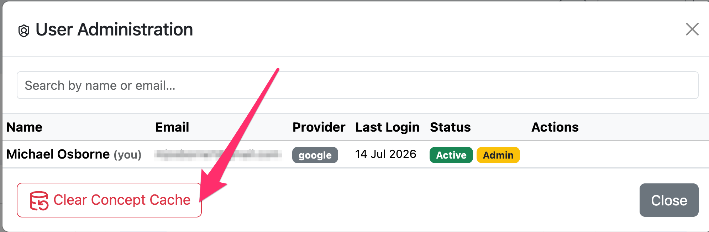

# Administration

Administrative functions are available to users with the **Admin** role. Open the **User Administration** dialog from the toolbar to manage users and perform maintenance tasks.

## Clearing the concept cache

AI-Map caches terminology lookups (concept displays, properties, and value set membership) to speed up automap and the mapping table. If the underlying terminology server is updated — for example when a code system version changes or a concept is retired — the cache can hold stale results.

Click **Clear Concept Cache** in the User Administration dialog to purge all cached terminology lookups. Subsequent lookups are re-fetched fresh from the terminology server.

*The **Clear Concept Cache** button in the User Administration dialog purges stale terminology lookups. Use it after a terminology server update, or if displays or value set membership appear out of date.*

Clearing the cache is safe: it does not affect any mappings, project data, or user accounts. The first few lookups after clearing may be slightly slower while the cache is repopulated.
