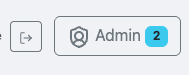
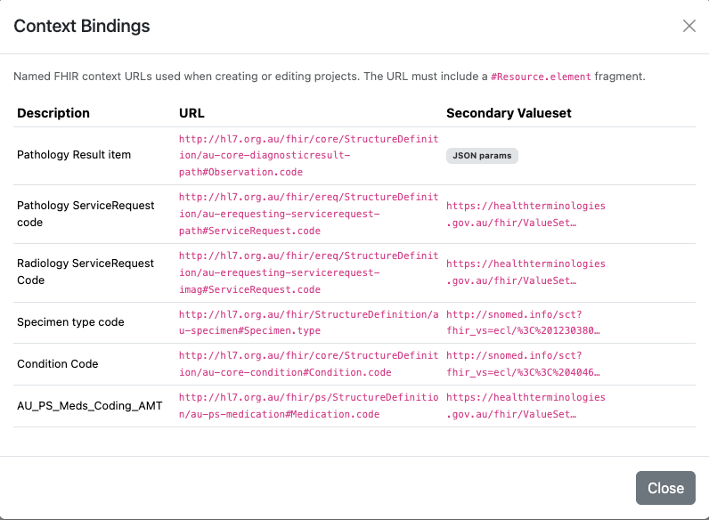
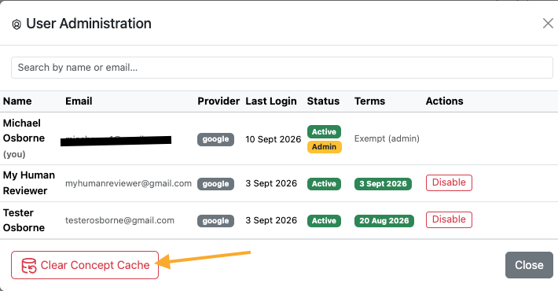

# Administration

Administrative functions are available to users with the **Admin** role. Open the **User Administration** dialog from the toolbar to manage users and perform maintenance tasks.

Site-wide admin access (this page) is separate from the per-project **Owner / Author / Reviewer / Reader** roles described in [Project roles](workflow/version-management.md#project-roles) — an admin can manage any user account, but still needs a project role to work on a specific mapping project.

## Managing user accounts

The **User Administration** dialog lists every user who has logged into AI-Map, with their name, email, login provider, last login time, and account **Status**. Search by name or email to find a specific user.

Every account is in one of three states:

| Status | Meaning |
| ------ | ------- |
| **Active** | The account has been approved and can sign in. |
| **Pending** | The person has signed in for the first time and is waiting for an administrator to approve them. Pending accounts are listed first. |
| **Disabled** | An administrator has disabled or rejected the account. It cannot sign in. |

For each user you can:

- **Approve / Reject** a *pending* account — Approve activates it; Reject leaves it inactive and records the decision, so the account moves to **Disabled** rather than staying in the queue.
- **Disable / Enable** an account that has already been decided on — a disabled user cannot log in.

You cannot disable your own account, to prevent accidentally locking yourself out.

<!-- TODO screenshot 60-AdminPendingApproveReject.png — the User Administration dialog with a
     Pending row showing its blue badge and the green Approve / red Reject buttons, alongside
     an Active row for contrast. Needs a real pending registration to stage.
     TODO screenshot (optional) 61-RejectConfirm.png — the Reject confirmation dialog. -->

!!! note "Admin access is not granted from the application"
    There is no **Make Admin** control. Site-wide admin rights come from the `admin_emails`
    deployment setting, which is authoritative in both directions: an address on that list is
    made an admin (and activated) at login, and an account removed from the list has its admin
    rights revoked at its next login. The **Admin** badge in the user list shows who currently
    holds them. To change who is an administrator, ask whoever maintains the deployment
    configuration.

## The pending approval queue

Nothing in a pending registration tells the person waiting when they will be approved, so the
queue has to come to you. When one or more accounts are waiting, the **Admin** button in the
toolbar carries a blue count badge — *"Accounts waiting for approval"* — showing how many.
The badge disappears once the queue is empty, and updates as soon as you approve or reject
an account without needing to reload the page.

*The **Admin** button in the toolbar with a pending count of 2 — two accounts are waiting for
a decision. The badge is hidden entirely when the queue is empty.*

Inside the dialog, pending accounts are sorted to the top of the list so they are the first
thing you see.

### Approval notification emails

Where the deployment is configured for it, AI-Map also emails the administrators as soon as a
registration arrives, with the subject *"AI Map: access request from &lt;name&gt;"*. The message
gives the person's name, email, and login provider, and links back to AI-Map with a reminder
to use the **Admin** button to approve or reject.

Notifications are best-effort and never block a sign-in: if mail is misconfigured or the mail
service is down, the registration still lands in the queue and the badge still appears — you
simply will not be told about it by email.

Notification email is configured at deployment time and is off unless it has been set up;
recipients are the same administrators who hold admin rights. If you are not receiving these
emails and expect to be, ask whoever maintains the deployment to check the mail settings.

---

## Managing context bindings

Context bindings are the shared list of FHIR contexts offered when a project is created (see
[Creating a project](workflow/getting-started.md#creating-a-project)). Because a binding is
deployment-wide configuration — and the URL it carries is fetched server-side during
validation — only an administrator can add, edit, or delete one. Everyone else can open
**⚙ Manage context bindings…** and read the list, but sees no editing controls.

Before adding an unfamiliar binding, try it in the **Test API** dialog first; see
[Trying out a context binding](appendix.md#trying-out-a-context-binding).

*The Context Bindings dialog for a non-admin: the Description, URL, and Secondary Valueset of
each binding are all readable, but the rows carry no edit or delete buttons and there is no
**Add binding** form beneath the table — only **Close**. An administrator sees the same list
with those controls in place.*

---

## Clearing the concept cache

AI-Map caches terminology lookups (concept displays, properties, and value set membership) to speed up automap and the mapping table. If the underlying terminology server is updated — for example when a code system version changes or a concept is retired — the cache can hold stale results.

Click **Clear Concept Cache** in the User Administration dialog to purge all cached terminology lookups. Subsequent lookups are re-fetched fresh from the terminology server.

*The **Clear Concept Cache** button in the User Administration dialog purges stale terminology lookups. Use it after a terminology server update, or if displays or value set membership appear out of date.*

Clearing the cache is safe: it does not affect any mappings, project data, or user accounts. The first few lookups after clearing may be slightly slower while the cache is repopulated.
