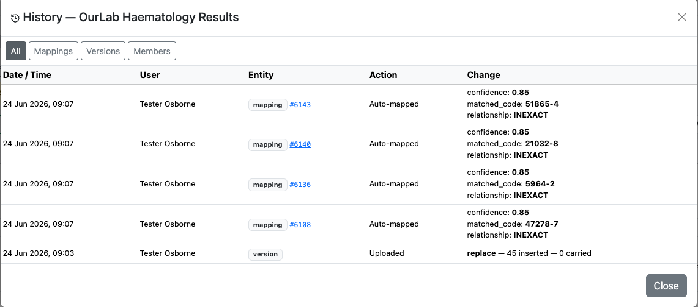
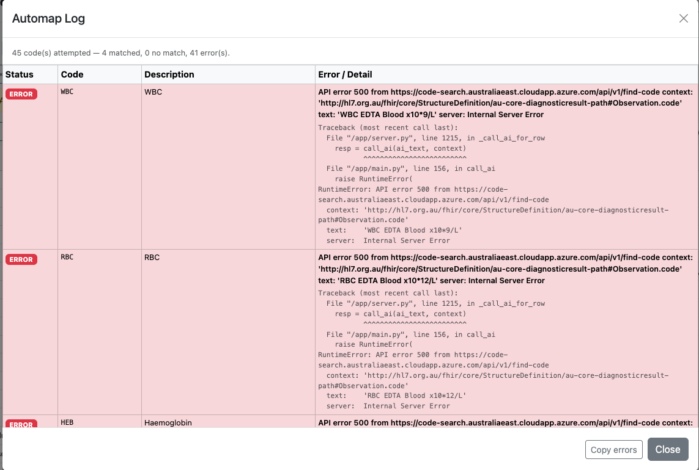

# Appendix

## Traceability

Every mapping action — automap runs, manual edits, version transitions, and member changes — is recorded in the project History with a timestamp and the authenticated user. This provides a full audit trail for governance and compliance purposes.

The History panel is accessible from any project via the **History** button in the toolbar. Use the **Mappings**, **Versions**, and **Members** tabs to filter the log.

*The Mappings tab shows each auto-mapped code with its confidence score, matched target code, and initial relationship. Manual edits appear below, showing exactly what changed and who made the change.*

---

## Troubleshooting

### Automap returns no match for some codes

The automap log lists every code that did not return a result, together with the exact query sent to the API. Common causes:

- **Highly abbreviated codes** (e.g. `WBC`, `RBC`) — the abbreviation alone gives the AI insufficient context. Ensure meaningful additional columns (Specimen Type, Units) are included in the automap text.
- **Terminology server unavailable** — if the Error/Detail column shows an API 500 error, the server may be temporarily unavailable. Wait a few minutes and re-run automap on the unmatched codes only (mapped codes are not affected by subsequent runs).

*API 500 errors in the automap log indicate the terminology server returned an unexpected error. The full request URL is shown to assist diagnosis.*

If errors persist, contact your administrator with the contents of the **Copy errors** output from the automap log.
