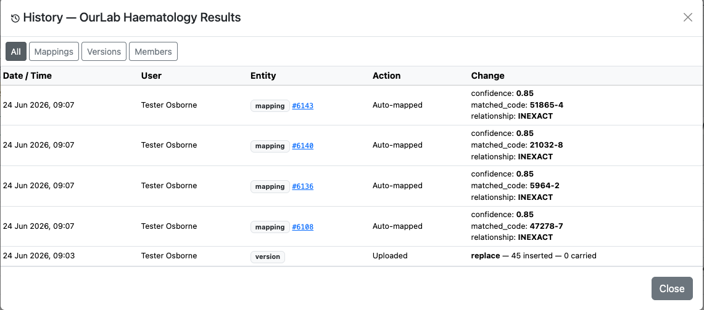
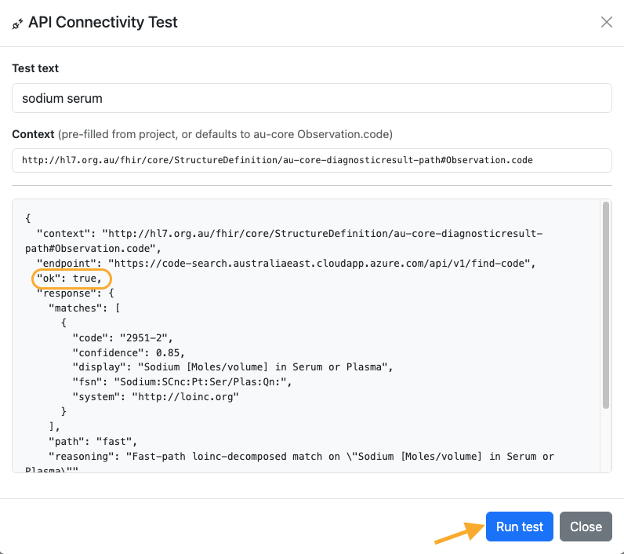
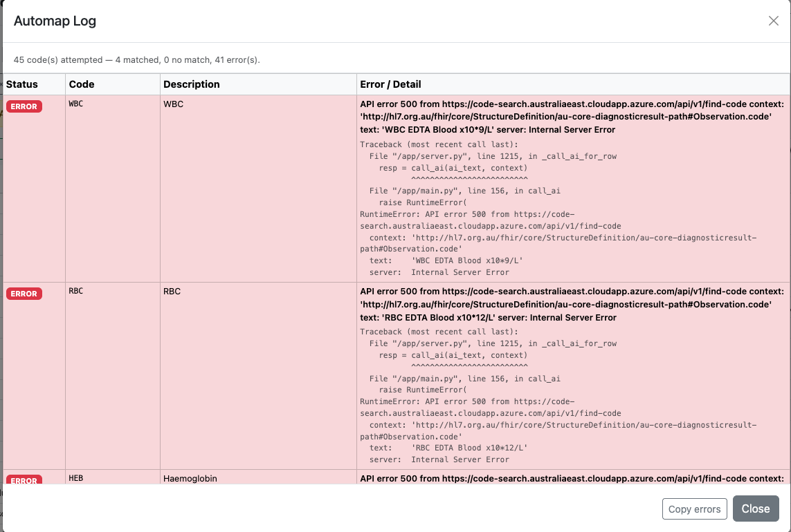

# Appendix

## CLI batch mode

For scripted, unattended pipelines, AI-Map also ships a headless CLI mode (`python main.py`) that reads a TSV of source codes, runs the same AI automap used by the web UI, and writes a result TSV — without needing a browser session or a project in the database. This is intended for automation and bulk pre-processing, not for review or governance; mappings produced this way still need to go through the normal project workflow (upload, review, finalise) if they are to be tracked and exported as a versioned ConceptMap. See the project `README.md` for the command-line flags.

## Traceability

Every mapping action — automap runs, manual edits, version transitions, and member changes — is recorded in the project History with a timestamp and the authenticated user. This provides a full audit trail for governance and compliance purposes.

The History panel is accessible from any project via the **History** button in the toolbar. Use the **Mappings**, **Versions**, and **Members** tabs to filter the log.

*The Mappings tab shows each auto-mapped code with its confidence score, matched target code, and initial relationship. Manual edits appear below, showing exactly what changed and who made the change.*

---

## Troubleshooting

### Check API connectivity first

Before investigating a mapping problem in detail, confirm that AI-Map can reach the
code-search API at all. Click **Test API** in the toolbar — the tooltip reads *Test API
connectivity*.

*The **Test API** button sits in the main toolbar, beside **Context Bindings** and **+ New
Project**.*

The **API Connectivity Test** dialog takes a **Test text** — any term you would expect to
map, such as `sodium serum` — and a **Context**, pre-filled from the current project or
defaulting to the au-core `Observation.code` context. Click **Run test** to send a live
request and display the raw JSON the API returns.

*A successful test. The response echoes the **context** and **endpoint** used, followed by
`"ok": true` and the **matches** the API found — here LOINC `2951-2` (Sodium
[Moles/volume] in Serum or Plasma) at 0.85 confidence, with the fsn, the **path** taken
(`fast`), and the **reasoning** behind the match.*

The quick check is the `"ok"` field:

- `"ok": true` — AI-Map reached the API and it responded normally. Connectivity is fine, so
  look for the cause of a mapping problem elsewhere (see below).
- Anything else, or no response at all — the API or terminology server is unreachable or
  erroring. Note the **endpoint** shown in the output and pass it to your administrator.

Because the response includes the matches themselves, a successful test also tells you
whether the API can find a sensible target for that particular term — useful for
distinguishing "the service is down" from "this code genuinely has no good match".

### Trying out a context binding

The same dialog is a convenient place to try a context **before** committing it to a
project. Paste a candidate context URL into the **Context** field, enter a representative
source term, and run the test: the matches that come back are the ones a project bound to
that context would draw on.

This is worth doing before adding an unfamiliar context to the shared preset list via
**⚙ Manage context bindings…** (see [Creating a project](workflow/getting-started.md)),
particularly when you are unsure whether a context is spelled correctly or scopes the
value set as you expect. A context that returns `"ok": true` but no useful matches is
usually too narrow, or not the right element for the kind of code being mapped.

### Automap returns no match for some codes

The automap log lists every code that did not return a result, together with the exact query sent to the API. Common causes:

- **Highly abbreviated codes** (e.g. `WBC`, `RBC`) — the abbreviation alone gives the AI insufficient context. Ensure meaningful additional columns (Specimen Type, Units) are included in the automap text.
- **Terminology server unavailable** — if the Error/Detail column shows an API 500 error, the server may be temporarily unavailable. Wait a few minutes and re-run automap on the unmatched codes only (mapped codes are not affected by subsequent runs).

*API 500 errors in the automap log indicate the terminology server returned an unexpected error. The full request URL is shown to assist diagnosis.*

If errors persist, contact your administrator with the contents of the **Copy errors** output from the automap log.
