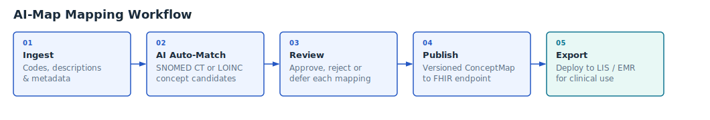

# Mapping Workflow

## Overview

The workflow moves a local code through five stages, from raw ingestion to a mapping published for use in a LIS or EMR. Each stage produces a defined output that feeds the next.

1. Ingest local source codes, descriptions and metadata (units, specimen type, synonyms).
2. AI auto-match to standard concepts (SNOMED CT or LOINC).
3. Review proposed mappings.
4. Publish approved mappings and version them.
5. Export for use in LIS/EMR

*Example mapping workflow — replace with your project-specific diagram.*

---

## Step-by-step guides

| Step | Guide |
| ---- | ----- |
| Log in and create a project | [Getting Started](workflow/getting-started.md) |
| Upload source terms and configure columns | [Loading Source Terms](workflow/loading-source.md) |
| Run AI auto-mapping | [AI Auto-Mapping](workflow/auto-mapping.md) |
| Review and edit individual mappings | [Reviewing Mappings](workflow/reviewing-mappings.md) |
| Submit for review, approve, and finalise | [Version Management & Review](workflow/version-management.md) |
| Import an updated source file as a new version | [Updating Source Data](workflow/updating-source.md) |
| Export the completed mapping | [Exporting](workflow/exporting.md) |
