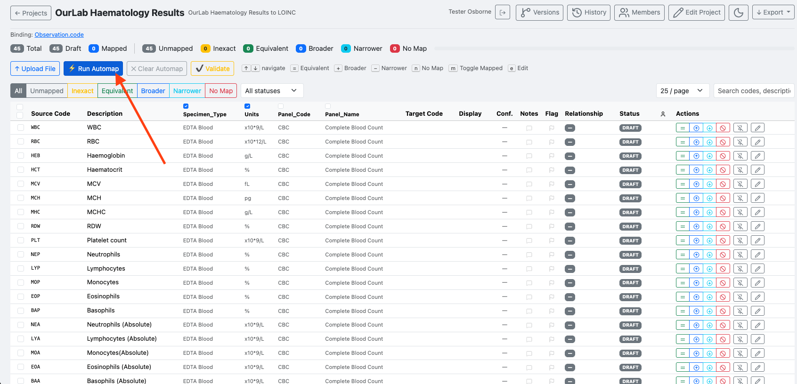
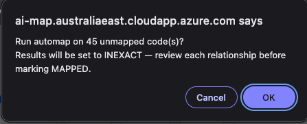
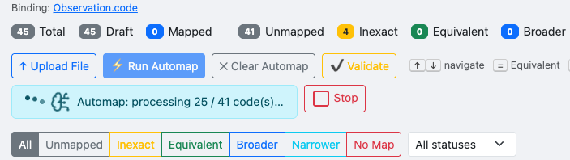
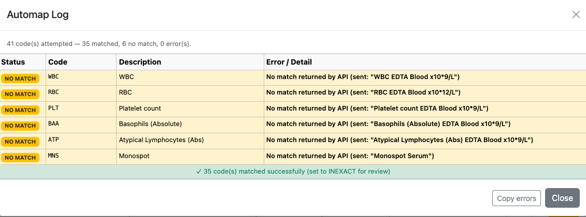
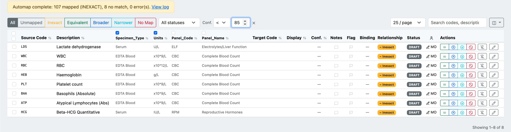

# AI Auto-Mapping

## Running automap

With source terms loaded, click **Run Automap**. The AI will query the terminology server and propose a target concept for each unmapped code.

*The mapping table after source upload. Click **Run Automap** to start the AI matching process.*

A confirmation dialog shows how many codes will be processed. Click **OK** to proceed.

*All automap results are initially set to **Inexact** — every suggestion must be reviewed before being marked Mapped.*

A progress indicator shows processing in real time. You can click **Stop** at any point to halt the run; codes processed so far will retain their suggested mappings.

*Automap processing 25 of 41 codes. Results appear in the table as each code is matched.*

---

## Reviewing the automap log

When the run completes, an **Automap Log** summarises the results.

*In this example: 41 codes attempted, 35 matched successfully (set to Inexact for review), 6 returned no match.*

**No match** entries show the exact query sent to the API. Common causes are highly abbreviated local codes (e.g. `WBC`, `RBC`) where the description alone is not enough context — these will need to be mapped manually. See [Troubleshooting](../appendix.md#troubleshooting) for API error codes.

Click **Close** to return to the mapping table and begin review.

---

## Filtering by confidence level

Once automap has run, use the **Conf.** filter in the toolbar to focus on mappings by their confidence score. Choose `<` or `>` from the operator dropdown, enter a percentage, and the table shows only the matching rows. Click the **×** to clear the filter.

*The confidence filter set to `< 85%`, showing only the codes that were not confidently auto-mapped — these are the mappings that most need manual review.*

Two common ways to use this filter:

- **Find low-confidence matches** — set `< 85%` to quickly see everything that automap was unsure about. 85% is a reasonable threshold: it surfaces the codes that need a closer look while hiding the strong matches.
- **Find high-confidence matches for bulk approval** — set `> 90%` to isolate the strongest matches, then use a [bulk action](version-management.md#bulk-actions-during-review) to set them all to **Equivalent** and **Mapped** in one step.
