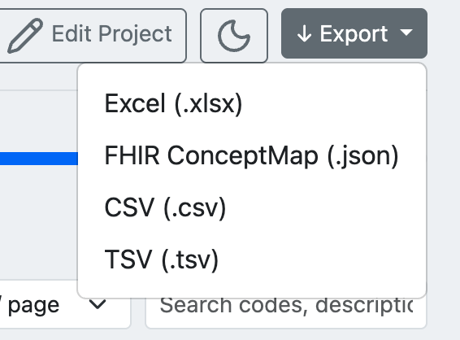
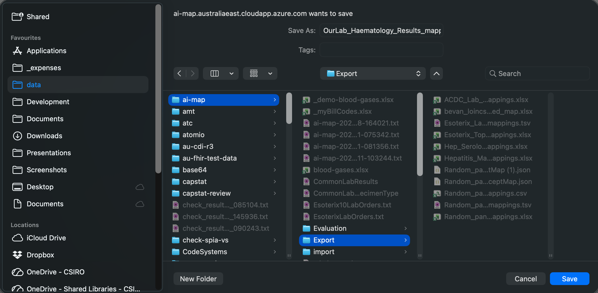
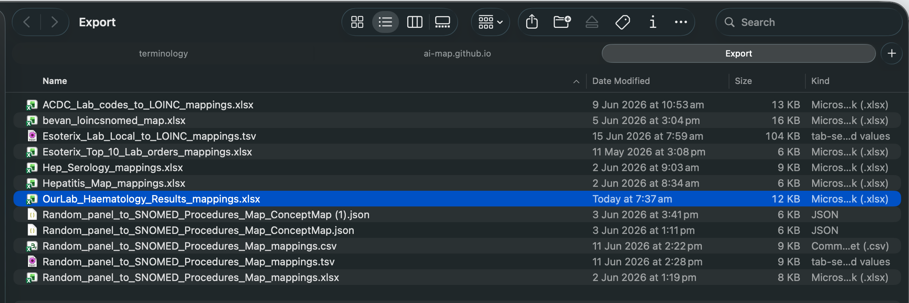
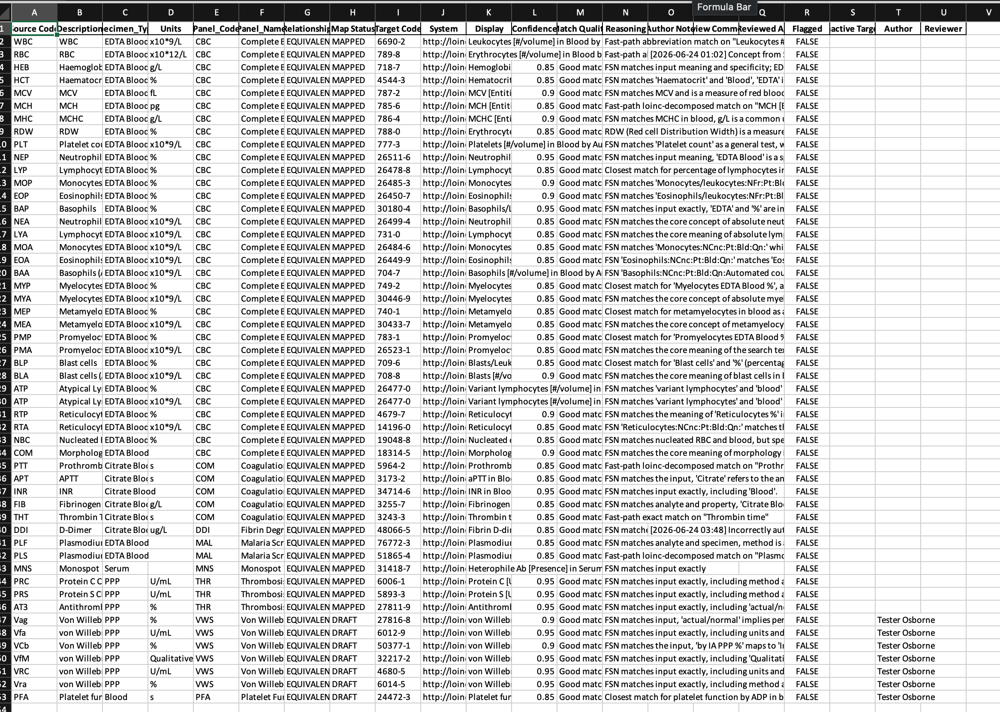

# Exporting

Once a version is finalised, click the **Export** button in the project toolbar and select a format.

| Format | Use case |
| ------ | -------- |
| **Excel (.xlsx)** | Human-readable review, loading into LIS/EMR import tools. |
| **FHIR ConceptMap (.json)** | Uploading to a FHIR server or terminology service. |
| **CSV (.csv)** | Integration with data pipelines and scripts. |
| **TSV (.tsv)** | Tab-separated variant of CSV for tools that prefer it. |

A system save dialog opens. Choose a destination folder and confirm the filename.

*The default filename includes the project name. Choose your export folder and click **Save**.*

The exported file appears in the chosen location.

*The `.xlsx` export alongside other mapping files. The filename reflects the project name and export date.*

## Export file contents

The Excel export contains one row per source code with all mapping metadata.

*Key columns in the export: Source Code, Description, additional source columns (Specimen Type, Units, etc.), Map Status, Target Code, System, Display, Confidence score, Match Quality, AI Reasoning, Author, Reviewed By, Flagged, and Active Target.*

This file is the primary handoff artefact for loading mappings into a LIS or EMR.
