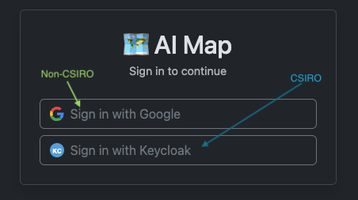
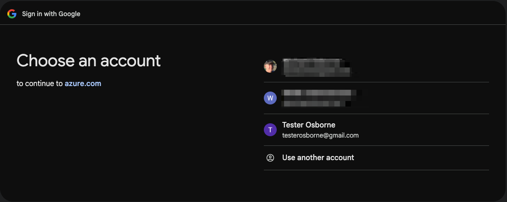
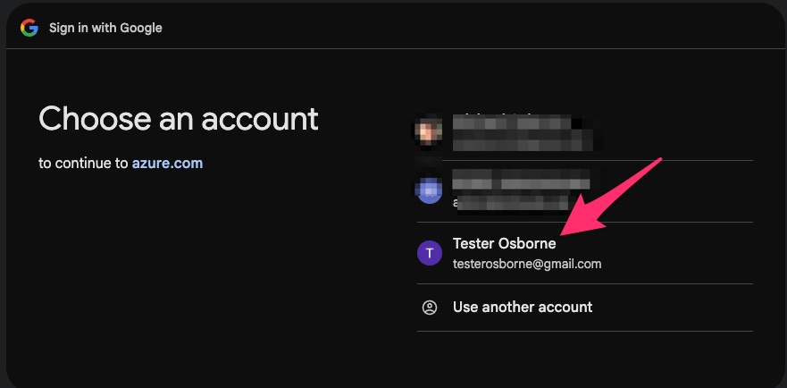
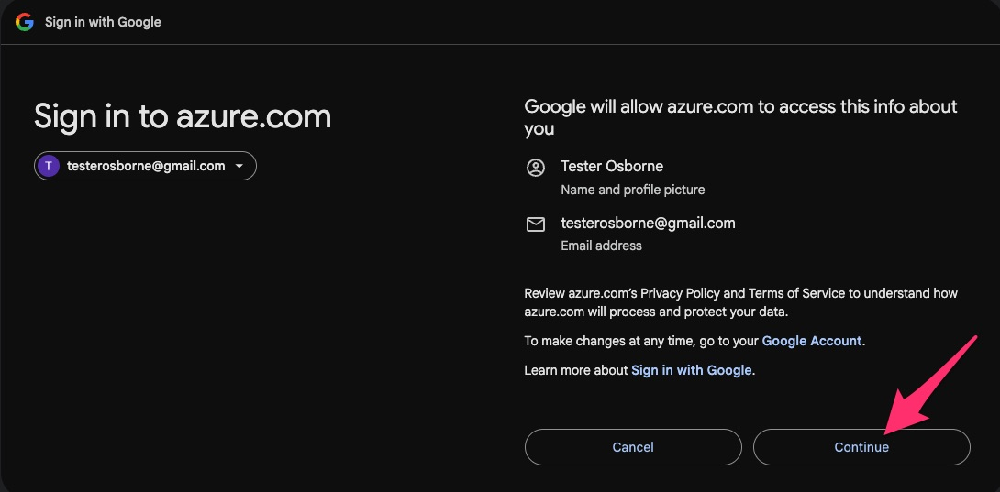
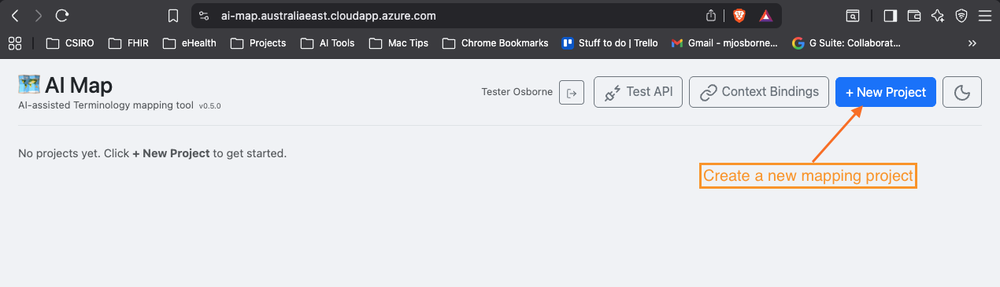
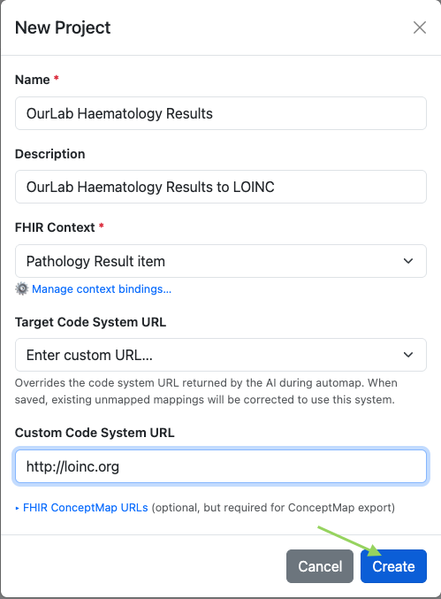

# Getting Started

## Logging in

Navigate to the AI-Map URL provided by your administrator. The login screen offers two options depending on your organisation.

*Choose **Sign in with Google** for non-CSIRO accounts, or **Sign in with Keycloak** for CSIRO accounts.*

Selecting Google opens the standard account chooser.

*Select the Google account you want to use.*

*Click your account to continue.*

Google will ask you to confirm access to azure.com. Click **Continue**.

*Confirm that Google may share your name and email with the application.*

---

## Creating a project

After logging in you will see your project list. Click **+ New Project** to create your first mapping project.

*The home page when no projects exist. Click **+ New Project** in the top-right corner.*

Fill in the project details and click **Create**.

| Field | Description |
| ----- | ----------- |
| **Name** | A short identifier for the project (e.g. `OurLab Haematology Results`). |
| **Description** | A human-readable summary (e.g. `OurLab Haematology Results to LOINC`). |
| **FHIR Context** | The FHIR element the source codes will be bound to (e.g. `Pathology Result item`). |
| **Target Code System URL** | The code system you are mapping to. Select a preset or enter a custom URL (e.g. `http://loinc.org`). |

The project opens immediately, ready for source terms to be uploaded.
