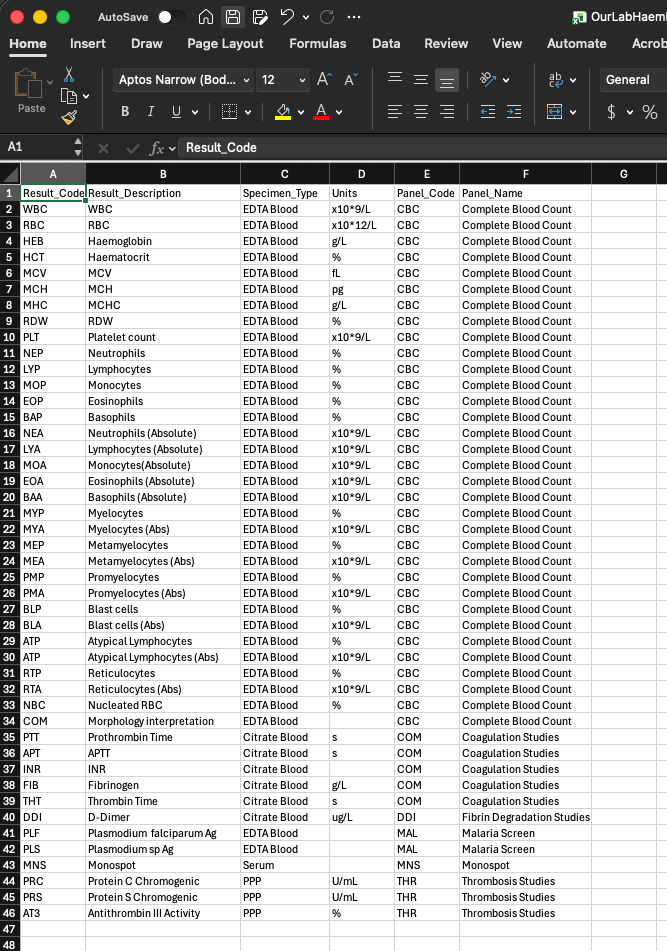
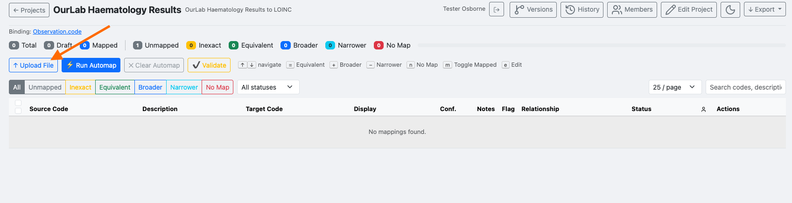
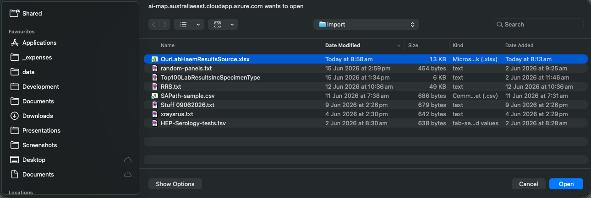
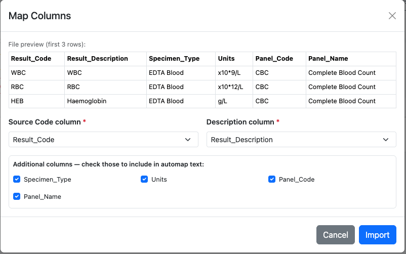
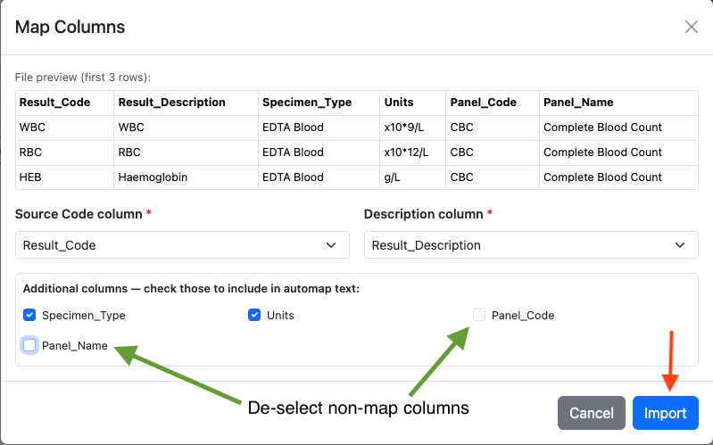

# Loading Source Terms

## Prepare your source file

Your source file should be an Excel (.xlsx), CSV, or TSV file with one row per source code. At minimum it needs a code column and a description column. Additional columns such as specimen type, units, and panel name improve automap accuracy and are carried through to the export.

*Example source file with columns: `Result_Code`, `Result_Description`, `Specimen_Type`, `Units`, `Panel_Code`, `Panel_Name`.*

---

## Uploading the file

From the project view, click **Upload File**.

*An empty project ready for source terms. Click **Upload File** to import.*

A file picker opens. Select your source file and click **Open**.

*Navigate to and select your source file.*

---

## Mapping columns

The **Map Columns** dialog previews the first three rows and asks you to identify which columns contain the source code and description.

*Set the **Source Code column** and **Description column** dropdowns to the correct fields.*

Under **Additional columns**, check any columns whose values should be included in the automap search text. De-select columns that are administrative or grouping fields that should not influence concept matching.

*In this example `Panel_Code` and `Panel_Name` are de-selected — they describe the panel, not the individual analyte, so they would reduce matching precision.*

Click **Import**. The source codes appear in the mapping table and the project is ready for automap.
