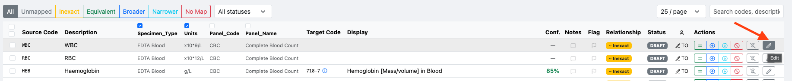
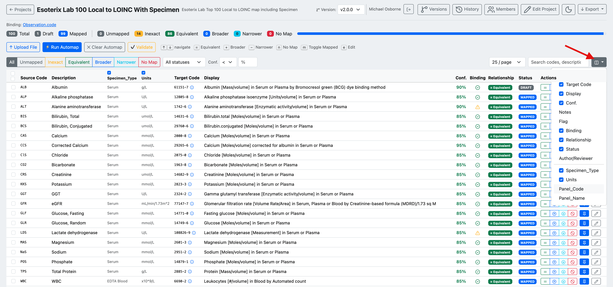
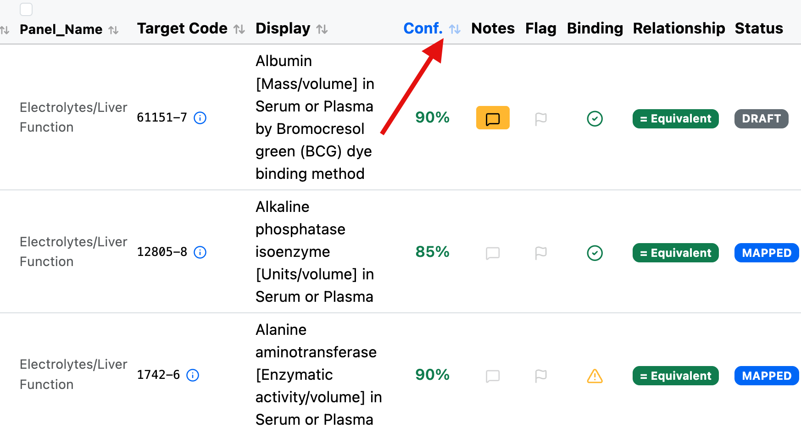
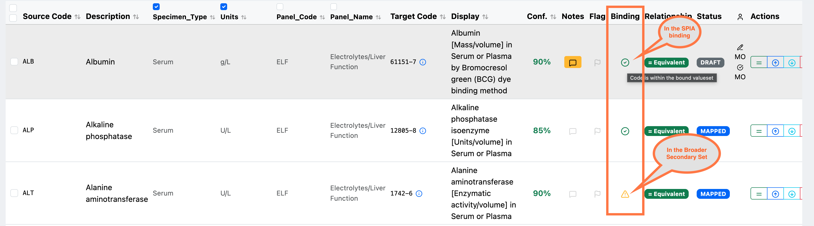
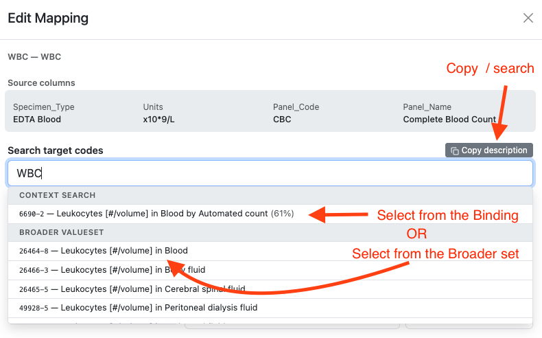
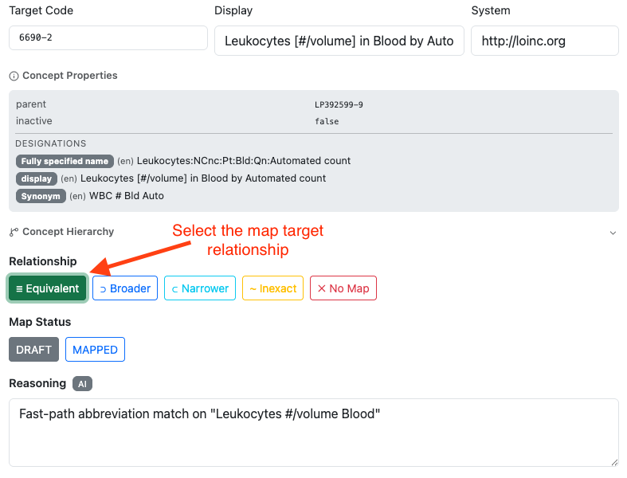
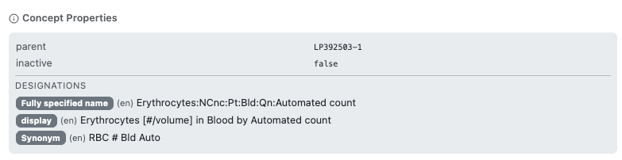
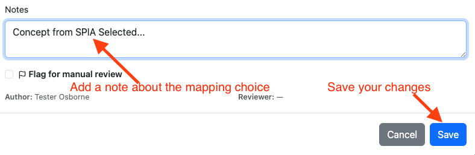
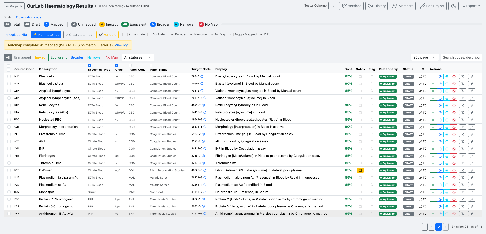
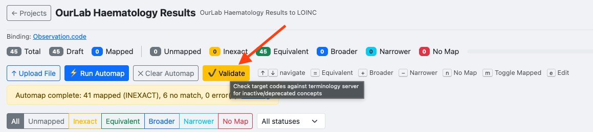

# Reviewing Mappings

## The mapping table

After automap, the table shows every source code alongside its proposed target. Codes are colour-coded by relationship type: **Inexact** (orange), **Equivalent** (green), **Broader** (blue), **Narrower** (teal), **No Map** (red). Unmapped codes have no target.

Use the filter tabs to work through one relationship type at a time, or use the keyboard shortcuts shown in the toolbar to navigate and set relationships without opening the edit panel.

*The table after automap. `WBC` and `RBC` have no target yet; `HEB` has been matched to LOINC `718-7` (Haemoglobin) at 85% confidence. Click the **Edit** button or press `e` to open the edit panel.*

---

## Choosing which columns to display

The mapping table can show a lot of information, and not every column is useful for every project. Use the **column selector** — the columns icon at the top-right of the table, next to the search box — to control which columns are displayed.

*The column selector lets you show or hide columns. Tick or untick a column to toggle it. Standard columns (Target Code, Display, Conf., Notes, Flag, Binding, Relationship, Status, Author/Reviewer) can be turned on or off, and any source columns from your uploaded data (e.g. Specimen_Type, Units, Panel_Code, Panel_Name) can be shown alongside them for context.*

Hiding columns you don't need makes the table easier to scan, especially when working with wide source data or on smaller screens.

---

## Sorting the table

Click a column header to sort the table by that column. Most columns are sortable — including **Source Code**, **Description**, and any user-defined source columns (e.g. Panel_Name) — as well as **Target Code**, **Display**, and **Conf.** The sort icon (↕) next to each header indicates a sortable column; click to sort ascending, click again to reverse. The active sort column is highlighted.

*Column headers show a sort icon. Text columns sort alphanumerically and numeric columns (such as Conf.) sort by value. The highlighted **Conf.** header indicates the table is currently sorted by confidence.*

Sorting alphanumerically by Source Code or Description makes it easy to locate a specific term, while sorting by confidence helps you review the lowest-confidence matches first.

---

## Binding indicator

The **Binding** column shows whether each mapped target code falls within the value set bound to the map. Hover over an indicator to see its explanation.

*The Binding column indicates how the mapped code relates to the bound value set:*

- ✅ **Green tick** — the code is within the bound value set (e.g. *"Code is within the bound valueset"* / in the SPIA binding).
- ⚠️ **Orange warning** — the code is outside the primary bound value set but found in a broader secondary set.

Use the binding indicator to confirm that mapped targets conform to the intended value set, and to spot mappings that may need review because they fall outside it.

---

## Editing a mapping

The **Edit Mapping** panel shows the source columns for context and a live search against the target code system.

*Source columns (Specimen Type, Units, Panel Code, Panel Name) are shown for reference. Type in the search box to find candidates. Results are split into **Context Search** (within the FHIR binding) and **Broader ValueSet** (wider search). Use **Copy description** to pre-fill the search with the source description.*

Select a candidate to load its concept details.

*Once a target is selected, the concept properties (parent, active status, designations, synonyms) are displayed. Choose the relationship type — **Equivalent**, **Broader**, **Narrower**, **Inexact**, or **No Map** — then set Map Status to **Mapped**.*

The **Concept Properties** panel shows the fully specified name, display name, and synonyms to help confirm the match is semantically correct.

*Concept properties for the selected target. Review the fully specified name and synonyms to confirm the concept matches your source term's intent.*

Add a note to record your reasoning, then click **Save**.

*Use the Notes field to record why this target was chosen (e.g. which reference or guideline was consulted). Check **Flag for manual review** if the mapping needs a second opinion.*

---

## Completed mappings

Work through all codes until the **Unmapped** count reaches zero.

*All 45 codes mapped. The status bar shows the breakdown by relationship type.*

---

## Validating target codes

Click **Validate** to check every mapped target code against the terminology server. This confirms that no target concept has been retired or made inactive since it was mapped.

*Validate checks for inactive or deprecated target concepts. Run this before submitting a version for review.*
