# Reviewing Mappings

## The mapping table

After automap, the table shows every source code alongside its proposed target. Codes are colour-coded by relationship type: **Inexact** (orange), **Equivalent** (green), **Broader** (blue), **Narrower** (teal), **No Map** (red). Unmapped codes have no target.

Use the filter tabs to work through one relationship type at a time, or use the keyboard shortcuts shown in the toolbar to navigate and set relationships without opening the edit panel.

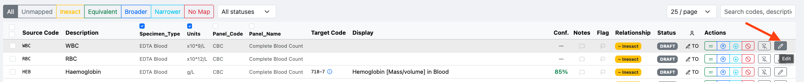

*The table after automap. `WBC` and `RBC` have no target yet; `HEB` has been matched to LOINC `718-7` (Haemoglobin) at 85% confidence. Click the **Edit** button or press `e` to open the edit panel.*

---

## Choosing which columns to display

The mapping table can show a lot of information, and not every column is useful for every project. Use the **column selector** — the columns icon at the top-right of the table, next to the search box — to control which columns are displayed.

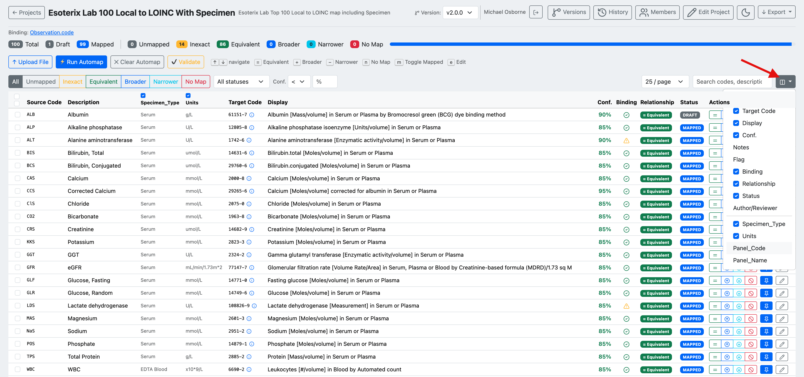

*The column selector lets you show or hide columns. Tick or untick a column to toggle it. Standard columns (Target Code, Display, Conf., Notes, Flag, Binding, Relationship, Status, Author/Reviewer) can be turned on or off, and any source columns from your uploaded data (e.g. Specimen_Type, Units, Panel_Code, Panel_Name) can be shown alongside them for context.*

Hiding columns you don't need makes the table easier to scan, especially when working with wide source data or on smaller screens.

---

## Sorting the table

Click a column header to sort the table by that column. Most columns are sortable — including **Source Code**, **Description**, and any user-defined source columns (e.g. Panel_Name) — as well as **Target Code**, **Display**, and **Conf.** The sort icon (↕) next to each header indicates a sortable column; click to sort ascending, click again to reverse. The active sort column is highlighted.

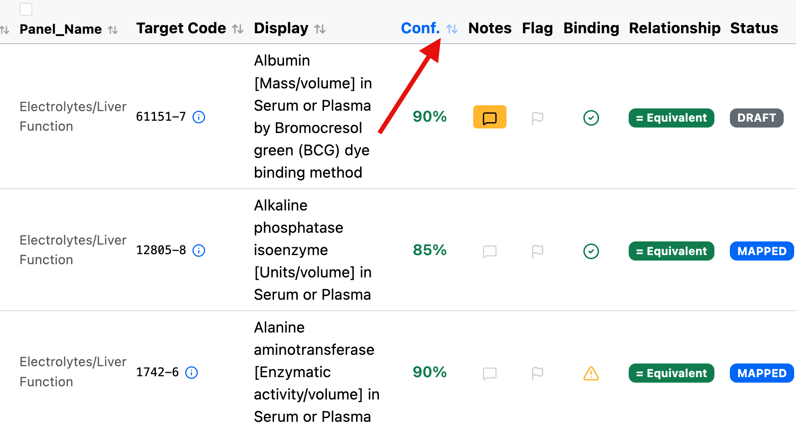

*Column headers show a sort icon. Text columns sort alphanumerically and numeric columns (such as Conf.) sort by value. The highlighted **Conf.** header indicates the table is currently sorted by confidence.*

Sorting alphanumerically by Source Code or Description makes it easy to locate a specific term, while sorting by confidence helps you review the lowest-confidence matches first.

---

## Binding indicator

The **Binding** column shows whether each mapped target code falls within the value set bound to the map. Hover over an indicator to see its explanation.

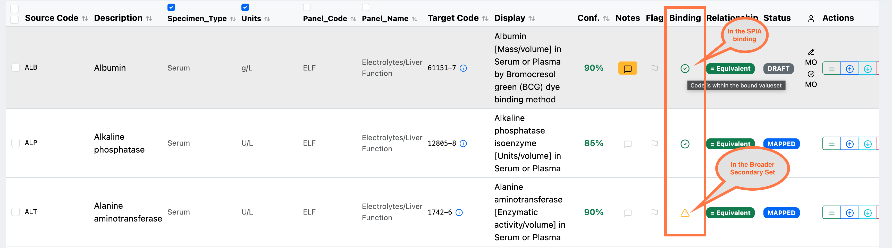

*The Binding column indicates how the mapped code relates to the bound value set:*

- ✅ **Green tick** — the code is within the bound value set (e.g. *"Code is within the bound valueset"* / in the SPIA binding).
- ⚠️ **Orange warning** — the code is outside the primary bound value set but found in a broader secondary set.

Use the binding indicator to confirm that mapped targets conform to the intended value set, and to spot mappings that may need review because they fall outside it.

---

## Editing a mapping

The **Edit Mapping** panel shows the source columns for context and a live search against the target code system.

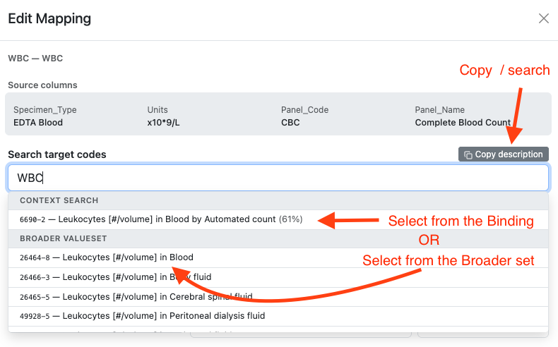

*Source columns (Specimen Type, Units, Panel Code, Panel Name) are shown for reference. Type in the search box to find candidates. Results are split into **Context Search** (within the FHIR binding) and **Broader ValueSet** (wider search). Use **Copy description** to pre-fill the search with the source description.*

### The agent's pick and the alternatives it considered

Under **Context Search**, AI-Map shows not only the concept the AI settled on but the other
candidates it weighed up on the way there. The two are distinguished by a marker and by the
kind of score they carry:

| | Marker | Score badge |
| --- | ------ | ----------- |
| **The agent's chosen match** | ✨ sparkles icon | Green (≥ 70%) or amber **confidence** percentage |
| **Candidates considered** | no marker | Grey **relevance** percentage |

The chosen match is always listed first and is never re-ordered below a candidate. Its
**reasoning** — the AI's explanation of why this concept fits the source term — is shown
beneath it and is saved with the mapping if you select it.

Candidates show a short note explaining how they relate to your search text (for example
*"more specific specimen than a general request"*). That note is there to help you choose
between them; it is not saved with the mapping, because it describes the search rather than
the mapping decision.

!!! note "Confidence and relevance are different scales"
    A candidate's grey **relevance** badge is deliberately not coloured like a match's
    confidence badge. Relevance measures how closely a concept matched the search text;
    confidence measures how sure the agent is that its chosen concept is the right target.
    A candidate scoring 90% relevance is not therefore a better answer than a match at 85%
    confidence — read the two as separate signals, and judge the concepts themselves.

The same match-and-candidates list appears in the **AI Suggestions** panel, which is
pre-populated from the source description when you open the edit panel.

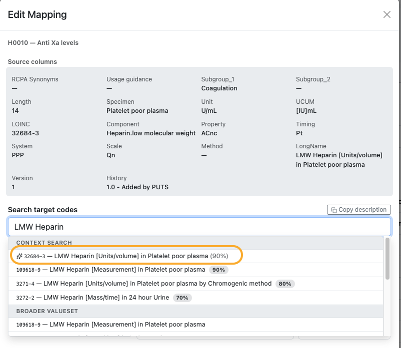

*Searching `LMW Heparin` for the source code `H0010 — Anti Xa levels`. The circled first row
is the agent's chosen match, LOINC `32684-3` (LMW Heparin [Units/volume] in Platelet poor
plasma), marked with the ✨ icon and carrying 90% **confidence**. The three rows beneath it
are the candidates it considered, each with a grey **relevance** badge — 90%, 80% and 70%.
Below them, **Broader ValueSet** repeats one of the concepts from the wider search.*

Note that in this example the first candidate scores 90% relevance — the same number as the
match's 90% confidence — while being a different concept (`LMW Heparin [Measurement]` rather
than `[Units/volume]`). That is exactly why the two badges are styled differently: the equal
percentages are measuring different things and do not make the two results equally good.

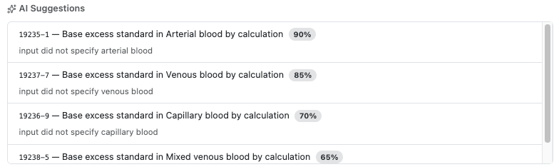

*The **AI Suggestions** panel for a base excess test. Here the agent returned no single
confident match — every row is a candidate, each with a grey relevance badge and a note
saying how it differs from the source term: "input did not specify arterial blood", then
venous, then capillary. The source description is not specific enough about specimen to
choose between them, which is the signal to check the source data or consult the requesting
service rather than simply take the top row.*

Whichever result you select — the agent's match, one of its candidates, or a Broader
ValueSet result — AI-Map records where the choice came from in the audit history, so a later
reviewer can see whether the mapper accepted the AI's pick or overrode it.

Select a candidate to load its concept details.

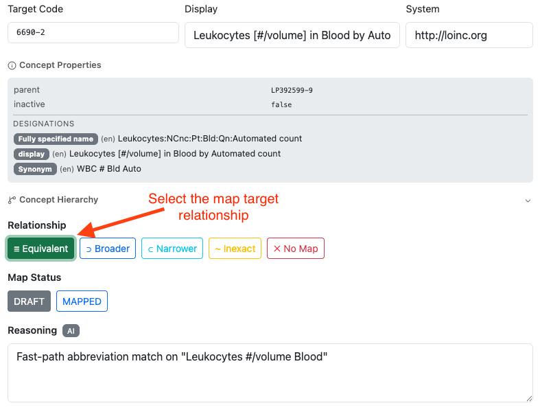

*Once a target is selected, the concept properties (parent, active status, designations, synonyms) are displayed. Choose the relationship type — **Equivalent**, **Broader**, **Narrower**, **Inexact**, or **No Map** — then set Map Status to **Mapped**.*

The **Concept Properties** panel shows the fully specified name, display name, and synonyms to help confirm the match is semantically correct.

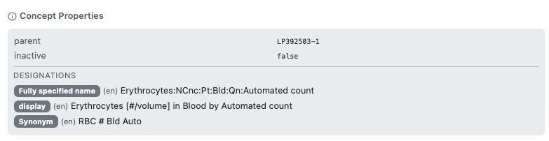

*Concept properties for the selected target. Review the fully specified name and synonyms to confirm the concept matches your source term's intent.*

Add a note to record your reasoning, then click **Save**.

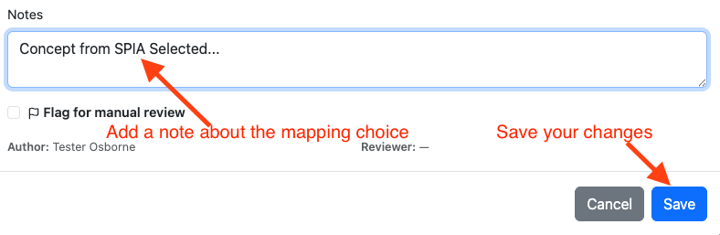

*Use the Notes field to record why this target was chosen (e.g. which reference or guideline was consulted). Check **Flag for manual review** if the mapping needs a second opinion.*

---

## Concept relationships and LOINC parts

The generic metadata in Concept Properties tells you a concept's status, but not what it
*means*. Two further sub-sections show how the target concept is actually defined, so you
can check a suggested match against the terminology itself rather than taking the AI's
reasoning text on trust. Both appear inside the Concept Properties panel — in the Edit
Mapping dialog and in the read-only info popover — and each is shown only for the code
system it applies to.

**RELATIONSHIPS** (SNOMED CT targets) lists the concept's defining attributes as
`attribute: value` rows — for example *Associated morphology: Infarct* and *Finding site:
Myocardium structure* on a myocardial infarction concept. These are what distinguish the
concept from its neighbours, so they are the quickest way to confirm that a plausible-looking
match is about the right finding, site, and morphology.

**PARTS** (LOINC targets) breaks the code down into its axes, in a fixed order:

| Axis | What it tells you |
| ---- | ----------------- |
| **Component** | What is measured (e.g. *Glucose*) |
| **Property** | The kind of quantity (e.g. *MCnc* — mass concentration) |
| **Time** | Whether it is a point-in-time or timed measurement |
| **System** | The specimen or system (e.g. *Serum or Plasma*) |
| **Scale** | Quantitative, ordinal, nominal, or narrative |
| **Method** | The method, where the code specifies one |
| **Class** | The LOINC class the code belongs to |

Axes that a given code does not specify are left out — **Method** in particular is absent
from many codes. Reading the axes is the reliable way to catch the near-misses that matter
in laboratory mapping: the right analyte measured on the wrong specimen, or a quantitative
code proposed for an ordinal result.

!!! note "Long relationship lists"
    Some concepts — complex medicinal products especially — have a great many defining
    relationships. The info popover shows the first 10 and then a note telling you how many
    more there are; open the **Edit Mapping** dialog to read the complete list.

A section is omitted entirely when it does not apply or the terminology server does not
return that detail for the code, so an absent **RELATIONSHIPS** section is not in itself a
sign that anything is wrong with the mapping.

---

## Viewing the concept hierarchy

From the Edit Mapping panel, click **Hierarchy** to expand a tree of the selected target concept's immediate parents and children, fetched live from the terminology server. Click any parent or child to re-centre the tree on that concept, or click **Use** to set it as the mapping target without leaving the panel — useful when the AI-suggested concept is close but a sibling or parent is a better fit.

The same hierarchy is available read-only from the concept info popover (click **Show hierarchy**) when you just want to explore relationships without changing the current mapping.

---

## Notes and discussion

Each mapping row has a single **Notes & Discussion** icon that opens a panel combining the private mapper note with a threaded comment log. The icon is highlighted whenever a note or comment already exists on the row, so reviewers can spot rows with open questions at a glance.

The panel has two parts:

- **Mapper Note** — a free-text field for recording why a target was chosen; click **Save note** to update it.
- **Discussion** — a comment thread for back-and-forth between the author and reviewer. Type a message and click **Post comment**; use **Reply** to respond to a specific comment, or **Edit**/**Delete** on your own comments. Comments support one level of replies.

Readers can view notes and the discussion thread but cannot post, edit, or delete comments.

### Finding the rows under discussion

Spotting highlighted icons row by row does not scale on a large map. Use the **Has
discussion** button in the toolbar — *"Show only rows with a note or discussion comment"* —
to filter the table down to just those rows. Click it again to clear the filter and return
to the full list.

This is the quickest way for an author to pick up everything a reviewer has queried, and it
combines with the relationship filter tabs, so you can narrow to (say) only the Inexact rows
that also carry an open comment.

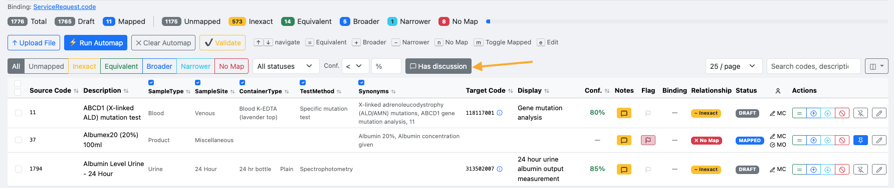

*The **Has discussion** button sits at the right-hand end of the filter row, after the
relationship tabs, the status dropdown, and the confidence filter. With it active, the table
shows only rows carrying a note or a comment — here every visible row has a highlighted Notes
icon, and code `37` also carries a flag.*

See [Discussing a mapping with the reviewer](version-management.md#discussing-a-mapping-with-the-reviewer) for a worked example of an author and reviewer using this panel during review.

---

## Completed mappings

Work through all codes until the **Unmapped** count reaches zero.

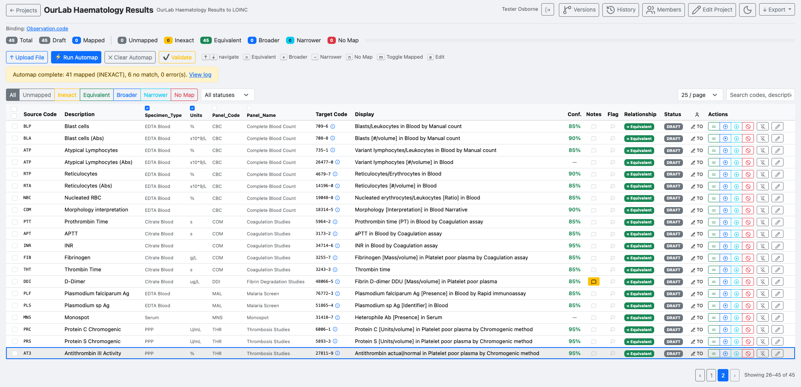

*All 45 codes mapped. The status bar shows the breakdown by relationship type.*

---

## Validating target codes

Click **Validate** to check every mapped target code against the terminology server. This confirms that no target concept has been retired or made inactive since it was mapped, and re-checks whether each target still falls within the project's bound value set (shown in the **Binding** column above).

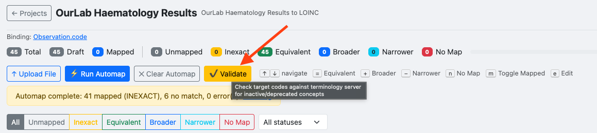

*Validate checks for inactive or deprecated target concepts. Run this before submitting a version for review.*
