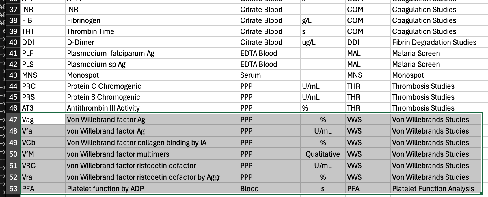
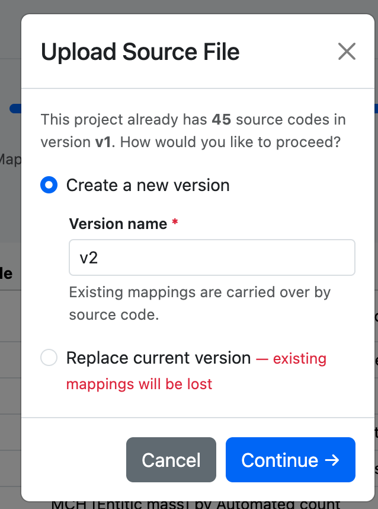
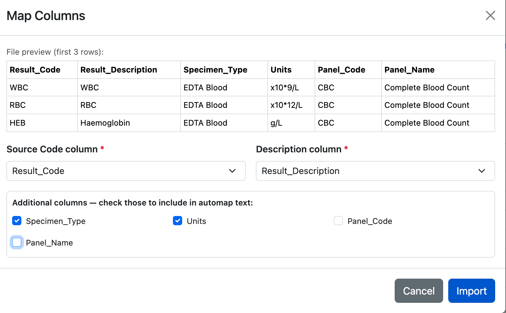
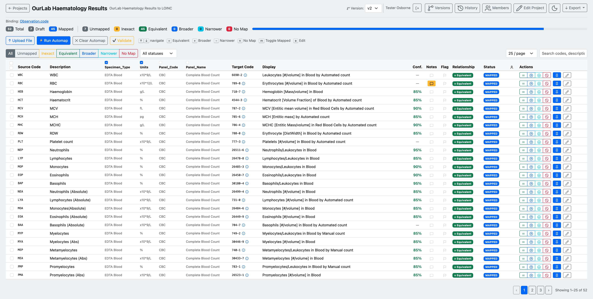
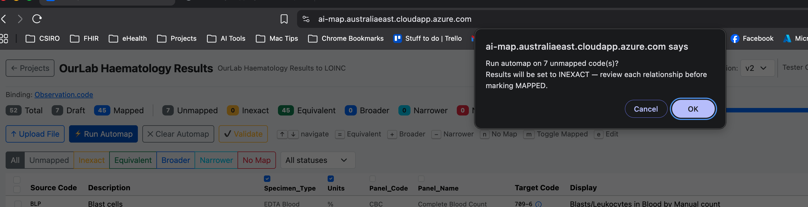
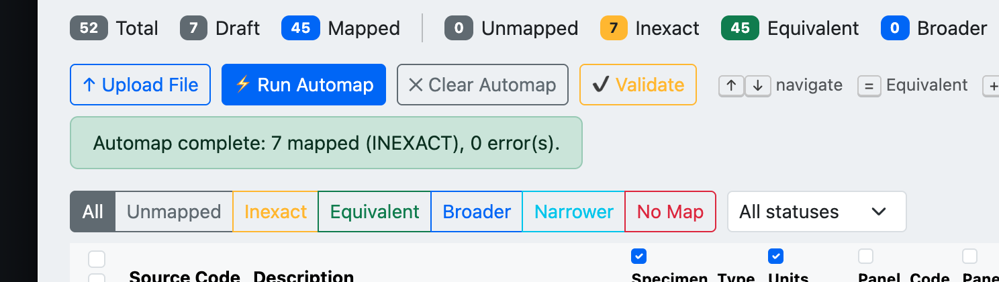
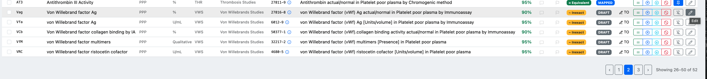
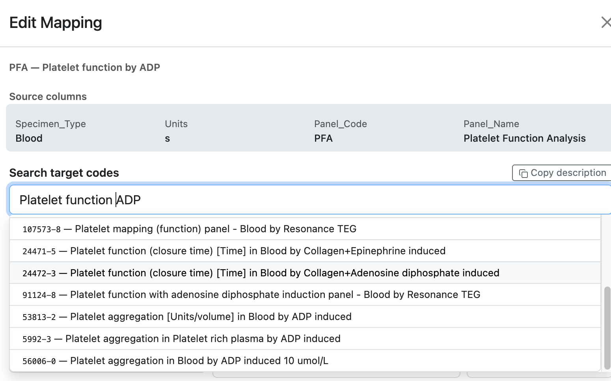

# Updating Source Data

When the source code list changes — new tests added, codes retired — upload a new source file to create a new version. Existing mappings are carried over automatically by source code, so only new or changed codes need to be reviewed.

## Prepare the updated source file

The new file should use the same column structure as the original. Any new rows will be added as unmapped; rows matching an existing source code will inherit the previous mapping.

*The v2 source file includes additional analytes (Von Willebrand factors, Platelet Function Analysis) not present in v1.*

---

## Upload as a new version

Click **Upload File** in the project toolbar. Because the project already has a finalised version, AI-Map asks how to proceed.

*Choose **Create a new version** and enter a version name (e.g. `v2`). Existing mappings are carried over by source code. **Replace current version** discards all existing mappings — use with caution.*

Click **Continue →**.

---

## Map columns

The **Map Columns** dialog appears again for the new file. Confirm the source code and description columns, and check the same additional columns as before.

*Confirm column selections are consistent with v1 to ensure carried-over mappings remain aligned.*

Click **Import**.

---

## Review and automap new codes

The mapping table now shows all codes from v2. Previously mapped codes retain their status; new codes appear as Unmapped.

*The v2 table shows 52 total codes: 45 carried over as Mapped from v1, 7 new codes to be mapped.*

Run automap to propose targets for the new codes. The confirmation dialog shows only the unmapped count.

*Only the 7 new unmapped codes are sent for automap — carried-over mappings are not affected.*

When complete, review the new suggestions.

*Automap complete: 7 new codes matched (set to Inexact for review), 0 errors. The 45 carried-over mappings remain at their previous status.*

The new codes appear at the end of the table, ready for review.

*The new Von Willebrand and Platelet Function codes (rows 26–52) are shown with their automap suggestions.*

Edit any mappings that need adjustment. For codes with multiple plausible candidates, the search results help distinguish between methods and specimen types.

*Searching for "Platelet function|ADP" returns multiple LOINC candidates differentiated by method — select the one that matches your instrument and specimen.*

Once all codes are mapped and validated, follow the [version management](version-management.md) workflow to submit v2 for review and finalise it.
