# Version Management & Review

## Audit history

Every change in AI-Map is logged. Click **History** in the toolbar to see the full audit trail for the project, including mapping edits, version status changes, and member additions.

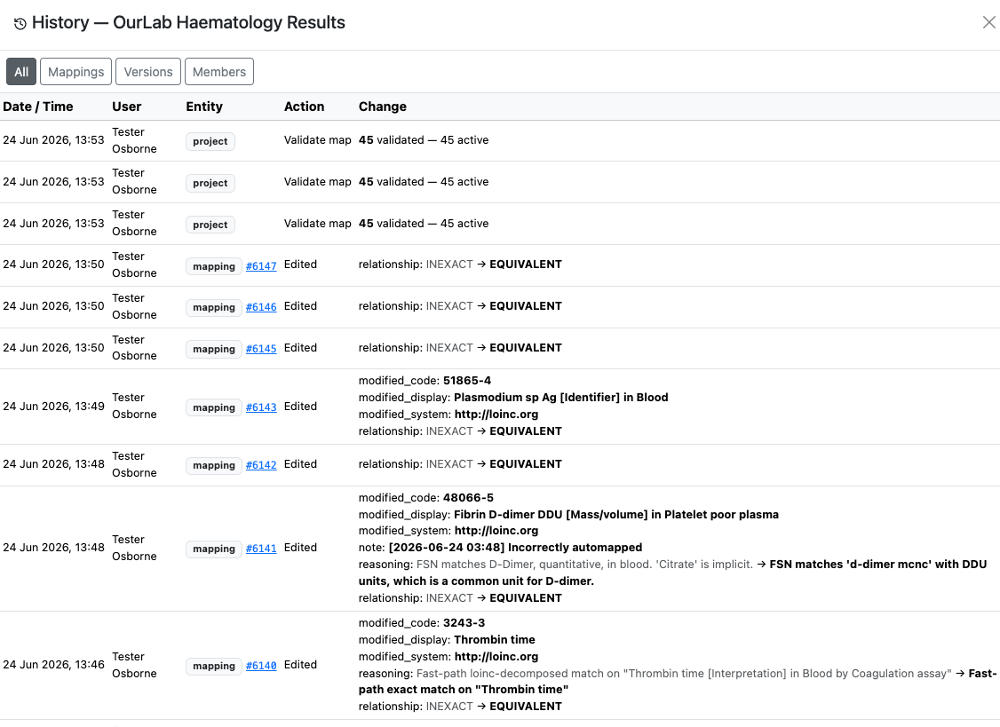

*The History panel records every action: who made it, when, what entity was changed, and the before/after values. Use the **Mappings**, **Versions**, and **Members** tabs to filter.*

---

## Adding a reviewer

Before submitting a version for review, add the reviewer as a project member. Click **Members** in the toolbar.

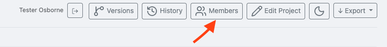

*Click the **Members** button to open the Project Members panel.*

Search for the reviewer by name or email address, confirm the **Reviewer** role is selected, and click **Add**.

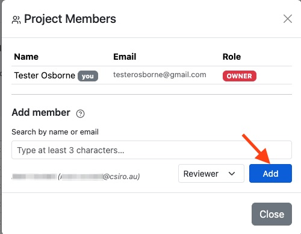

*Search by at least 3 characters of the reviewer's name or email. Select **Reviewer** from the role dropdown before clicking **Add**.*

The reviewer now appears in the members list and has access to the project.

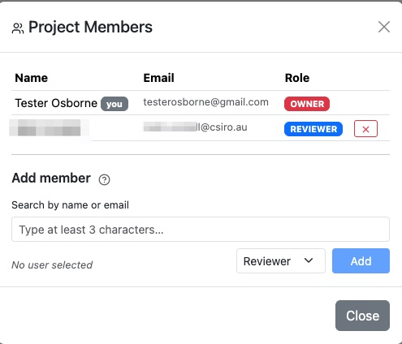

*The reviewer is listed with the REVIEWER badge. They can now view the project and mark versions as reviewed.*

---

## Submitting a version for review

Click **Versions** in the toolbar to open the Map Versions panel. This lists all versions of the mapping with their current status.

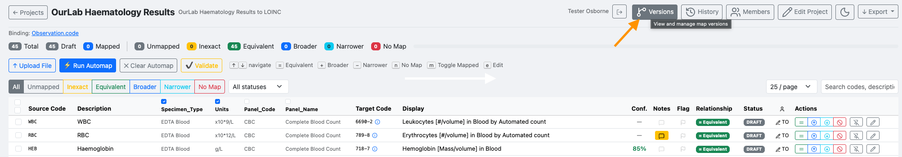

*The Versions panel shows the version label, status, dates, and available actions.*

Click **Submit for Review** on the active draft version.

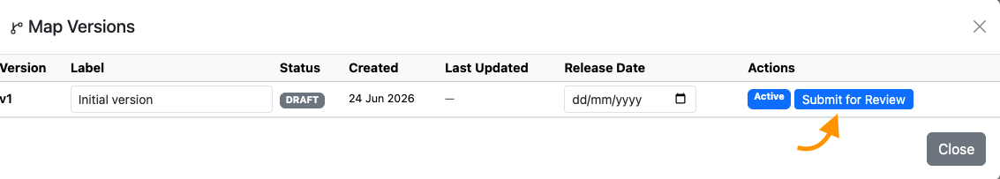

*Version `v1 — Initial version` in DRAFT status. Click **Submit for Review** to send it to the reviewer.*

Confirm the submission.

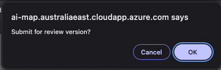

*Click **OK** to confirm. The version status changes immediately.*

The version status changes to **Submitted** and the reviewer can now mark it reviewed or send it back.

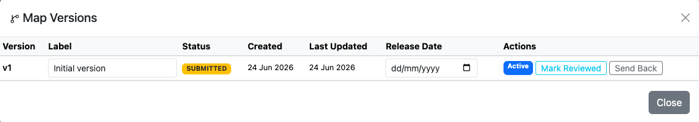

*The version is now SUBMITTED. The reviewer sees **Mark Reviewed** and **Send Back** options.*

---

## Bulk actions during review

Reviewers can select multiple rows and apply a relationship type or mapped status to all of them at once using the bulk action toolbar that appears at the bottom of the table.

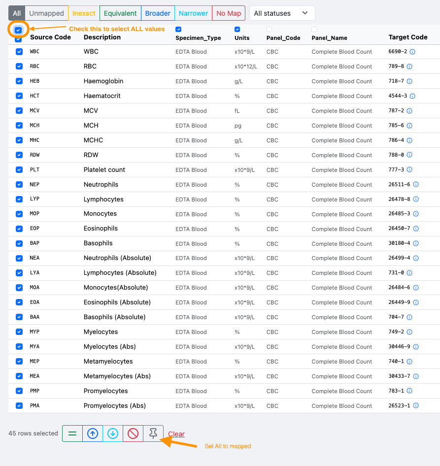

*Select rows using the checkboxes, then use the bulk action toolbar to set the relationship or status across all selected mappings simultaneously.*

---

## Marking as reviewed and finalising

Once the reviewer is satisfied, they click **Mark Reviewed**. The version status moves to **Reviewed**.

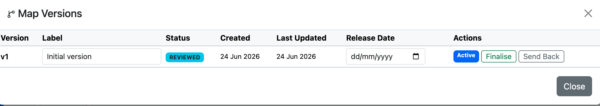

*The version is REVIEWED. The project owner now sees the **Finalise** button.*

The project owner clicks **Finalise** to lock the version.

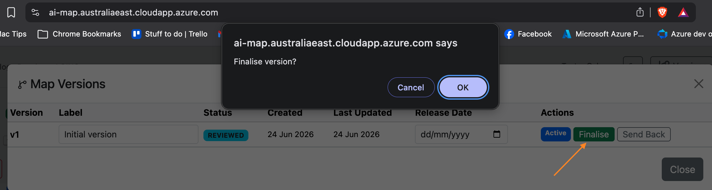

*A confirmation dialog appears before finalising. A finalised version cannot be edited.*

The version status becomes **Final** — it is now read-only and ready for export.

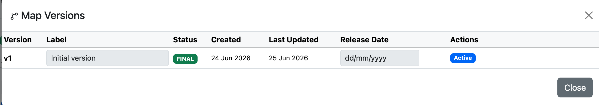

*Version `v1` is FINAL and marked Active. No further changes can be made to this version.*

The full lifecycle is visible in the History panel.

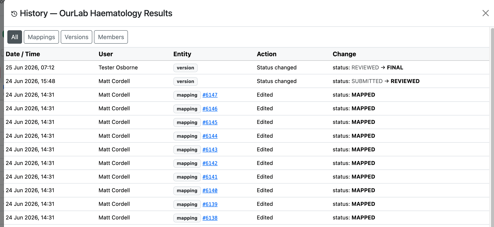

*The Versions tab in History shows the complete status progression: SUBMITTED → REVIEWED → FINAL, with the user and timestamp for each transition.*
