# Version Management & Review

## Project roles

Access to a project is controlled by per-project roles, assigned from the **Members** panel:

| Role | Can do |
| ---- | ------ |
| **Owner** | Everything — edit mappings, run automap, upload, manage members, finalise versions, delete or archive the project. |
| **Author** | Read and edit mappings (relationship, target overrides, note, reasoning, flag), run automap, upload source files. Cannot set a mapping's status to a reviewer-only value. |
| **Reviewer** | Read and export everything; can change a mapping's status (e.g. Draft → Mapped) but not its relationship, target overrides, note, or reasoning. |
| **Reader** | Read-only — can view mappings, versions, exports, the audit history, and concept lookups, but cannot edit a mapping, run automap, upload a file, or post a comment. |

Use **Reader** for stakeholders who need visibility into a mapping project (e.g. a clinical sign-off contact) without the ability to change it.

---

## Audit history

Every change in AI-Map is logged. Click **History** in the toolbar to see the full audit trail for the project, including mapping edits, version status changes, and member additions.

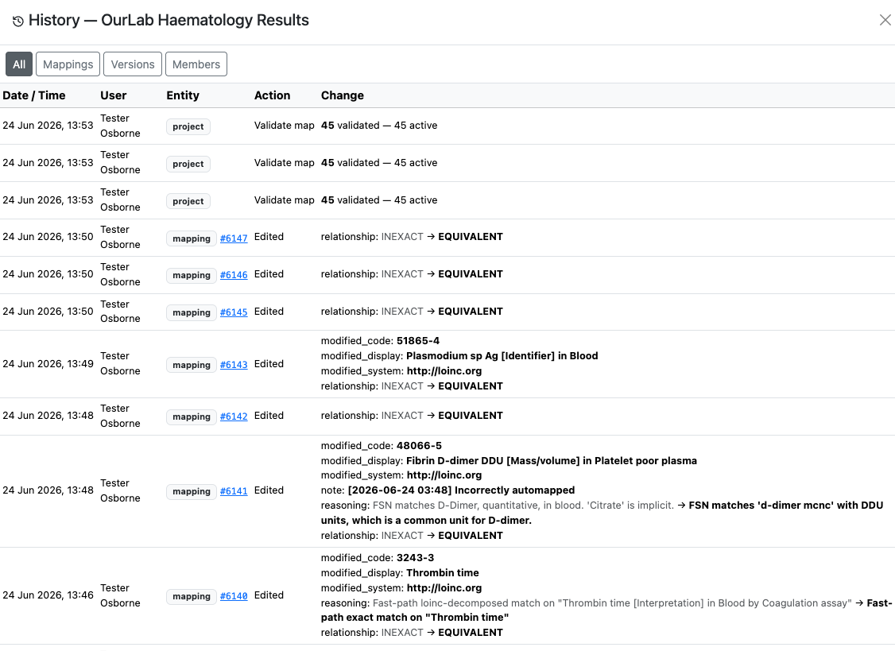

*The History panel records every action: who made it, when, what entity was changed, and the before/after values. Use the **Mappings**, **Versions**, and **Members** tabs to filter.*

---

## Adding a reviewer

Before submitting a version for review, add the reviewer as a project member. Click **Members** in the toolbar.

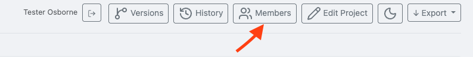

*Click the **Members** button to open the Project Members panel.*

Search for the reviewer by name or email address, select the **Reviewer** role from the dropdown (Author, Reviewer, Reader, or Owner), and click **Add**.

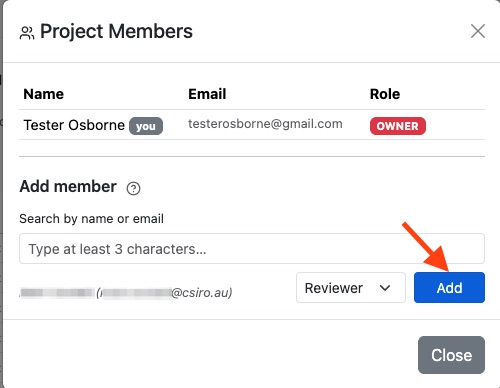

*Search by at least 3 characters of the reviewer's name or email. Select **Reviewer** from the role dropdown before clicking **Add**.*

The reviewer now appears in the members list and has access to the project.

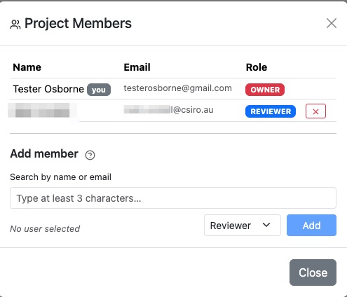

*The reviewer is listed with the REVIEWER badge. They can now view the project and mark versions as reviewed.*

---

## Submitting a version for review

Click **Versions** in the toolbar to open the Map Versions panel. This lists all versions of the mapping with their current status.

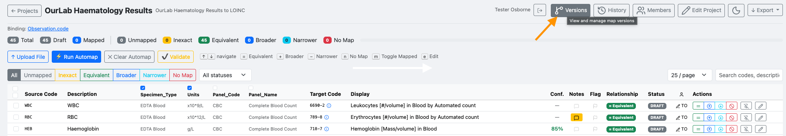

*The Versions panel shows the version label, status, dates, and available actions.*

Click **Submit for Review** on the active draft version.

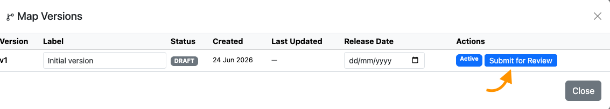

*Version `v1 — Initial version` in DRAFT status. Click **Submit for Review** to send it to the reviewer.*

Confirm the submission.

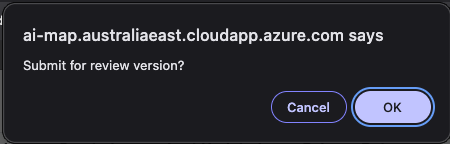

*Click **OK** to confirm. The version status changes immediately.*

The version status changes to **Submitted** and the reviewer can now mark it reviewed or send it back.

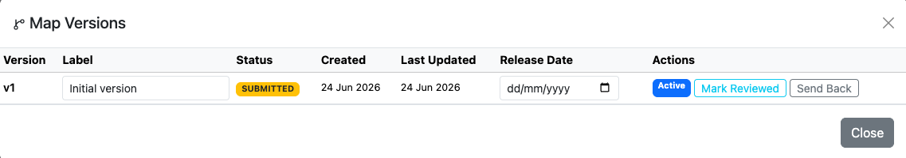

*The version is now SUBMITTED. The reviewer sees **Mark Reviewed** and **Send Back** options.*

---

## Bulk actions during review

Reviewers can select multiple rows and apply a relationship type or mapped status to all of them at once using the bulk action toolbar that appears at the bottom of the table.

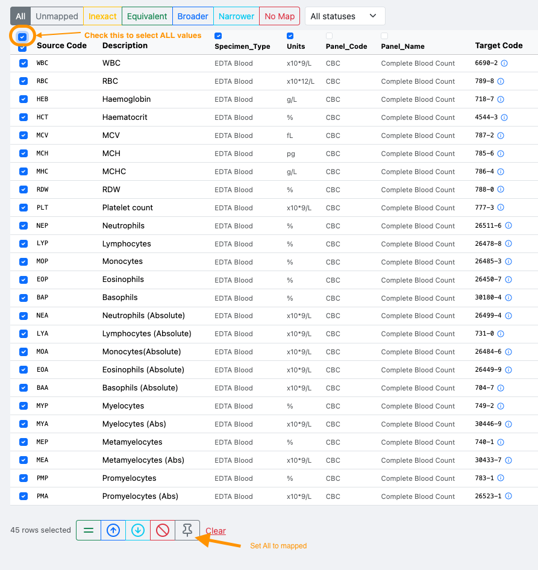

*Select rows using the checkboxes, then use the bulk action toolbar to set the relationship or status across all selected mappings simultaneously.*

---

## Discussing a mapping with the reviewer

Review is rarely a single pass — a reviewer often needs to question a particular mapping rather than send the whole version back. The **Notes & Discussion** panel on each row is where that conversation happens, so the reasoning stays attached to the mapping it concerns instead of living in email.

Open it with the comment icon in the mapping table. The icon is highlighted, and its tooltip shows a count, whenever the row already has a note or comments — so you can scan a version for rows that need attention before working through them.

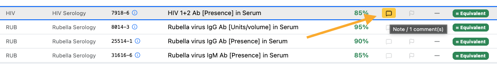

*The HIV row shows a highlighted comment icon with the tooltip **Note / 1 comment(s)**, indicating this mapping already has a mapper note and one comment. Rows with no discussion show a plain, unhighlighted icon.*

Clicking the icon opens the panel, which combines the mapper's note with the threaded discussion.

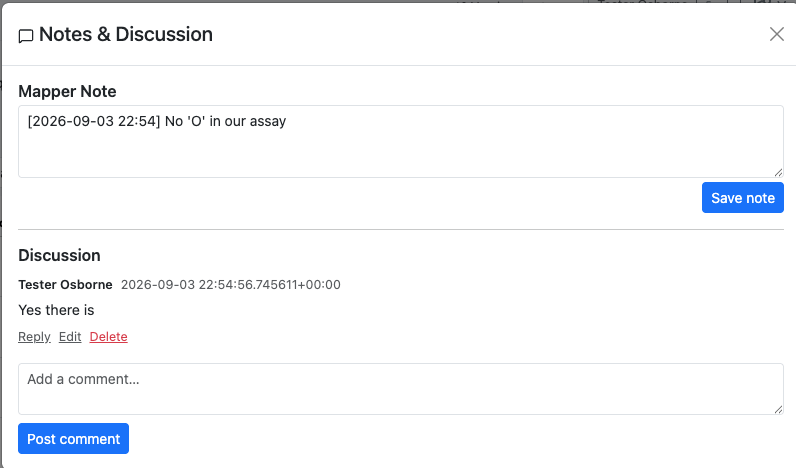

*The **Mapper Note** at the top records the author's reasoning for the mapping — here, `No 'O' in our assay`. Below it, **Discussion** shows the reviewer's reply (`Yes there is`) with their name and timestamp. Use **Reply** to respond within the thread, or **Edit** / **Delete** on your own comments.*

The two parts serve different purposes:

- **Mapper Note** — the author's record of why a target was chosen. Edit the text and click **Save note** to update it. Only Owners and Authors can change it; Reviewers and Readers see it read-only.
- **Discussion** — the back-and-forth between author and reviewer. Type a message and click **Post comment**. Comments support one level of replies, and each is stamped with the author's name and time. Owners, Authors, and Reviewers can post; **Readers can view the thread but cannot post, edit, or delete comments.**

Because comments are timestamped and attributed, the thread doubles as a record of why a contested mapping was settled the way it was. Notes and comments persist after a version is marked final, so the discussion stays available as provenance for the finalised map — but an unanswered question also stays visible. Work through the rows with highlighted comment icons and resolve any outstanding discussion before marking the version reviewed.

---

## Marking as reviewed and finalising

Once the reviewer is satisfied, they click **Mark Reviewed**. The version status moves to **Reviewed**.

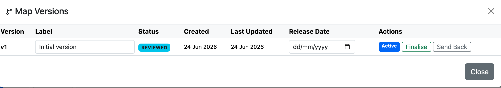

*The version is REVIEWED. The project owner now sees the **Finalise** button.*

The project owner clicks **Finalise** to lock the version.

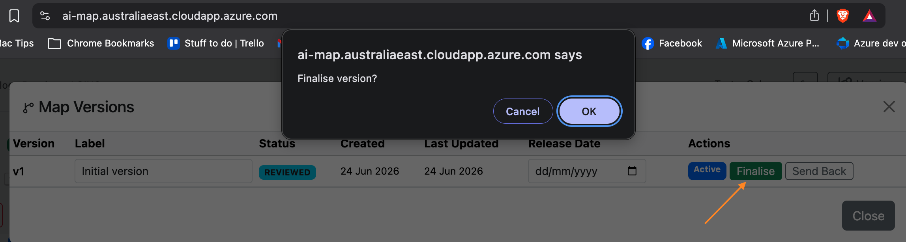

*A confirmation dialog appears before finalising. A finalised version cannot be edited.*

The version status becomes **Final** — it is now read-only and ready for export.

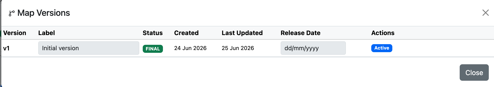

*Version `v1` is FINAL and marked Active. No further changes can be made to this version.*

The full lifecycle is visible in the History panel.

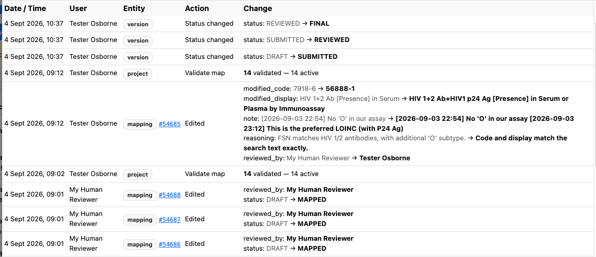

*The Versions tab in History shows the complete status progression: SUBMITTED → REVIEWED → FINAL, with the user and timestamp for each transition.*

---

## Archiving a project

Once a mapping project is complete, or otherwise doesn't need to stay in your main project list, click **Archive** on its card to hide it. Archiving does not lock or otherwise change the project — mappings can still be opened and edited normally, versions can still be submitted and finalised, and nothing is deleted. It only affects whether the project appears in the default list.

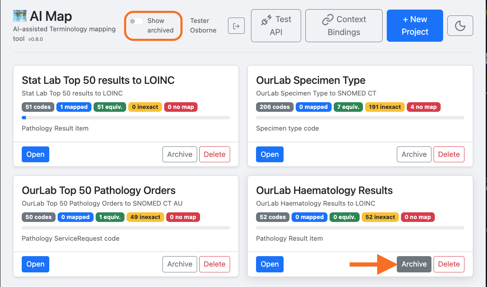

*Click **Archive** on a project card to hide it from the default project list.*

To see archived projects again, switch on **Show archived** in the toolbar. Archived projects reappear in the list with an **Archived** badge, and their **Archive** button becomes **Unarchive**.

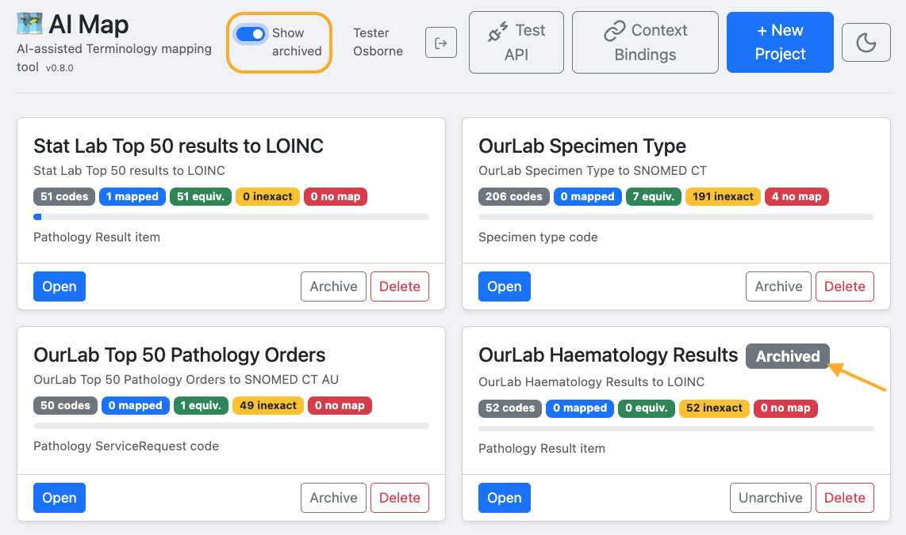

*With **Show archived** on, the archived **OurLab Haematology Results** project is shown with an **Archived** badge and an **Unarchive** button. Click **Unarchive** to return it to the default list.*
